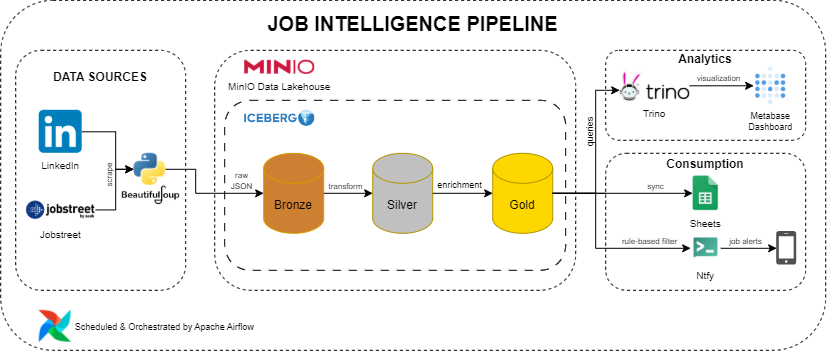
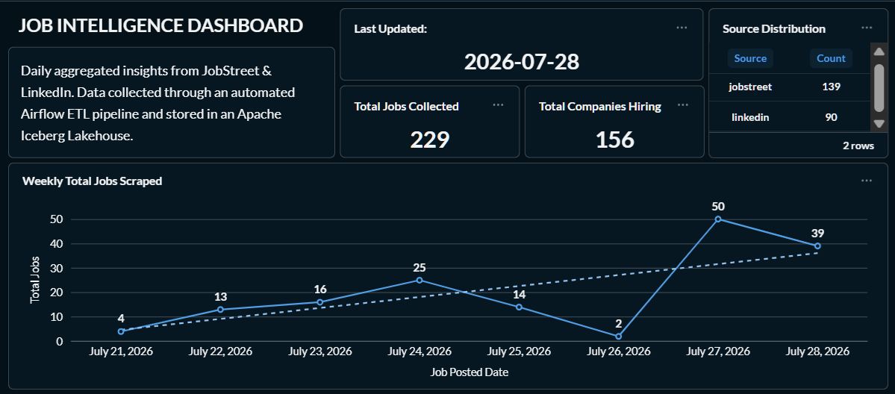
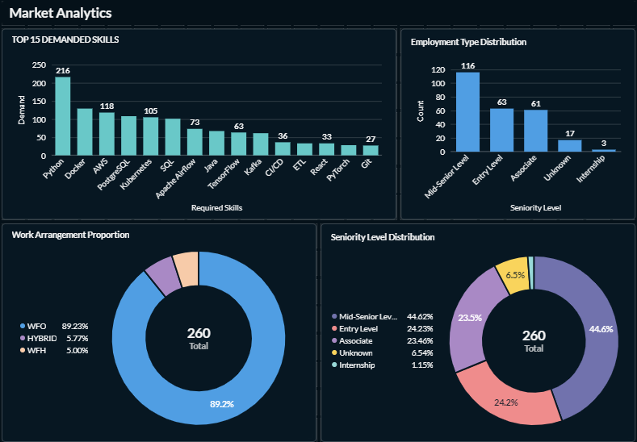
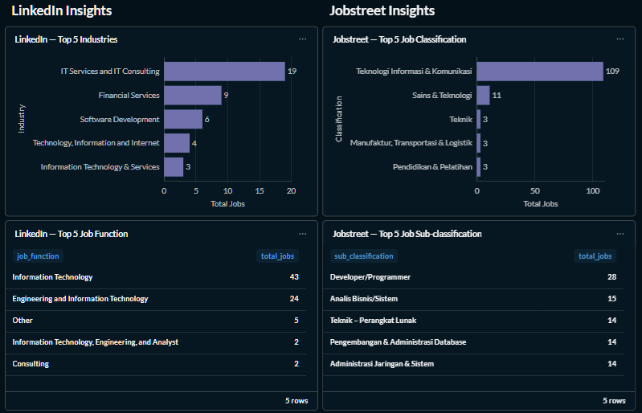
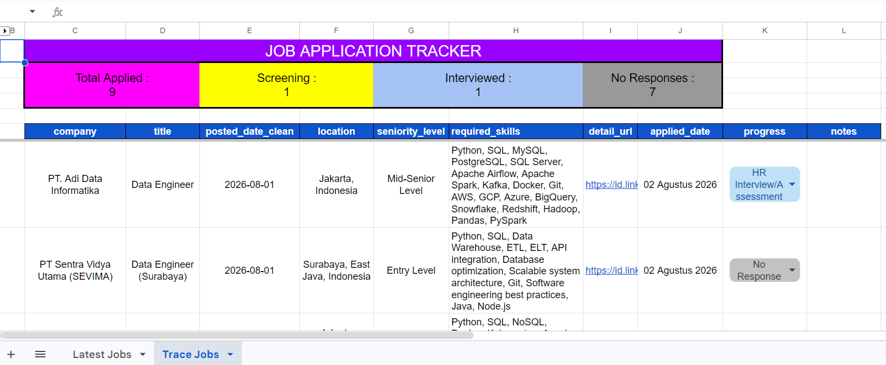
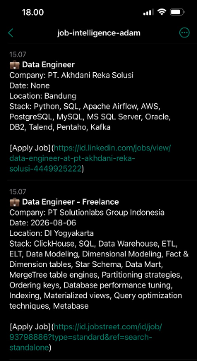

# Job Intelligence Platform

An end-to-end pipeline Data Engineering project that automatically collects job postings from multiple job portals, processes them through a modern Lakehouse architecture, enriches the data using LLM-based business intelligence, and delivers both interactive analytics and real-time job notifications.

The platform is designed around incremental data processing to ensure that only newly discovered job postings are processed, enriched, synchronized, and notified during each pipeline execution.

## Key Features

- Automated job scraping from multiple sources
- Medallion Lakehouse Architecture (Bronze, Silver, Gold)
- Apache Iceberg tables on MinIO Object Storage
- Incremental ETL pipeline orchestrated by Apache Airflow
- AI-powered business enrichment using Groq LLM
- SQL analytics through Trino
- Interactive dashboard with Metabase
- Google Sheets synchronization for personal job tracking
- Real-time mobile notifications using self-hosted ntfy

## Architecture

  

The platform is orchestrated by Apache Airflow and follows a modern Medallion Lakehouse architecture. Raw job postings are collected from multiple sources, transformed through Bronze, Silver, and Gold layers, then consumed by analytics and downstream services including dashboard, Google Sheets, and mobile notifications.

## 🛠️ Tech Stack

| Category               | Technology              | Purpose                                              |
| ---------------------- | ----------------------- | ---------------------------------------------------- |
| Workflow Orchestration | Apache Airflow          | Schedule and orchestrate the ETL pipeline            |
| Programming Language   | Python                  | Scraping, transformation, enrichment, and automation |
| Data Sources           | LinkedIn, JobStreet     | Job vacancy collection                               |
| Web Scraping           | BeautifulSoup, Requests | Extract job postings                                 |
| Data Lakehouse         | MinIO + Apache Iceberg  | Bronze, Silver, and Gold storage layers              |
| Query Engine           | Trino                   | SQL query engine for Iceberg tables                  |
| AI Enrichment          | Groq API (LLM)          | Seniority classification and skill extraction        |
| Dashboard              | Metabase                | Analytics and monitoring dashboard                   |
| Job Tracker            | Google Sheets API       | Personal job application tracker                     |
| Notification           | ntfy (Self-hosted)      | Real-time job alerts to mobile device                |
| Data Format            | JSON, Parquet           | Raw and optimized storage formats                    |
| Containerization       | Docker                  | Reproducible local environment                       |
| Version Control        | Git & GitHub            | Source code management                               |

## Data Layers

The platform implements a Medallion Lakehouse Architecture using Apache Iceberg tables stored in MinIO Object Storage.

Data is progressively refined through three layers: Bronze, Silver, and Gold.

---

### 🥉 Bronze Layer

Stores raw job postings collected from multiple job sources.

Key characteristics:

- Raw ingestion layer
- Preserves original scraped data
- Deduplication

---

### 🥈 Silver Layer

Contains cleaned and standardized job data prepared for further processing.

Key characteristics:

- Schema standardization
- Data cleaning and normalization
- Field normalization

---

### 🥇 Gold Layer

Provides business-ready job intelligence through AI enrichment.

Key characteristics:

- LLM-based job enrichment
- Required skills extraction
- Seniority classification
- Role categorization

This layer serves as the primary source for analytics, tracking, and notification systems.

## Outputs

### 📊 Analytics Dashboard

The dashboard visualizes business insights from the Gold Layer, enabling analysis of job trends, skill demand, seniority distribution, and data source performance.

### 📋 Job Tracking

The job tracker synchronizes enriched job data into Google Sheets, allowing users to manage application progress and track job opportunities efficiently.

### 🔔 Job Alerts

The push notification system delivers personalized job alerts by applying user-defined rules on enriched job data and sending relevant opportunities directly to mobile devices.

## Future Improvements

Potential improvements for future development:

- Implement real-time job ingestion using streaming architecture.
- Improve AI-powered enrichment with more advanced LLM models.
- Add automated data quality monitoring and pipeline observability.
- Expand job sources and improve scraper reliability.
- Deploy the platform into a cloud environment for scalability.

## References

- [Apache Iceberg](https://iceberg.apache.org/) - Open table format for large-scale analytic datasets.
- [Medallion Architecture](https://www.databricks.com/glossary/medallion-architecture) - Data organization pattern used for Bronze, Silver, and Gold layers.
- [ntfy](https://ntfy.sh/) - Simple open source HTTP-based notification service used for mobile job alerts.
